<!--ts-->
<!--te-->

# What

This:

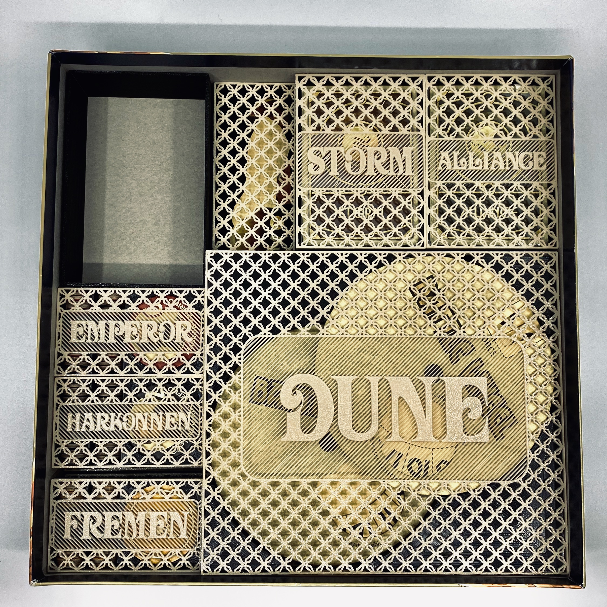
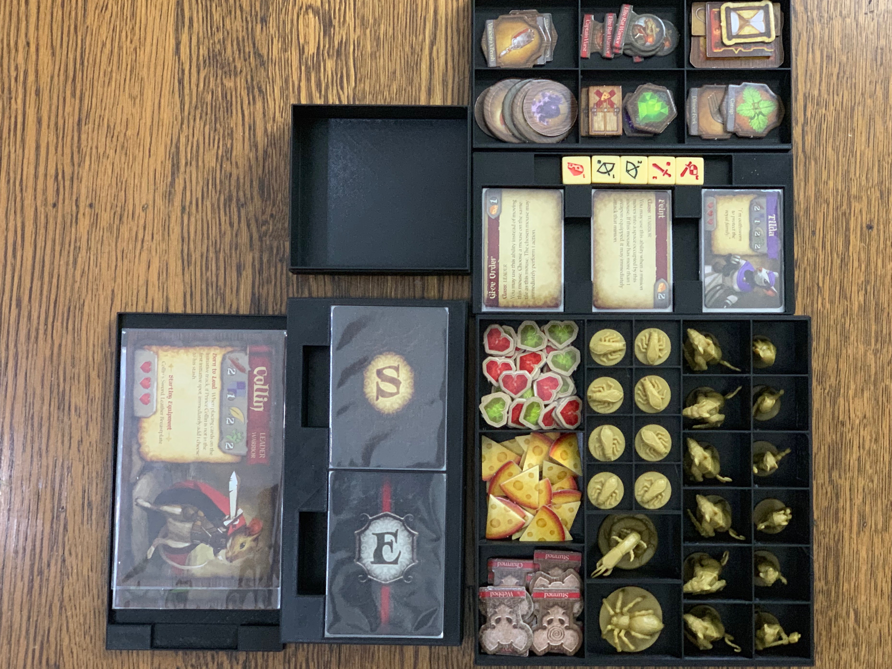
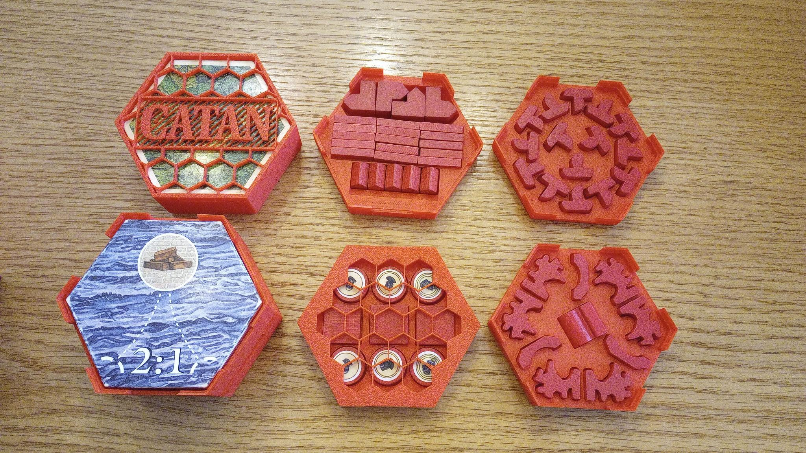

# Why
This OpenSCAD library was designed to for quick design and iteration on board game inserts--specifically ones with lids. There are lots of great printable inserts out there, but very few for us vertical storers.

# How
- Download [Openscad](https://www.openscad.org).
- Create a new directory for the board game you're working on. It's best to keep the BIT file with the board game file because future BIT versions may not be backwards compatible and this way you will always be able to recreate the STLs.
- Put _boardgame_insert_toolkit_library.3.scad_, _bit_functions_lib.3.scad_, and a copy of _starter.scad_ in the directory. Feel free to rename _starter.scad_ to something more descriptive.
- You'll be working entirely in your copy of the example.
- The first line should be __include <boardgame_insert_toolkit_lib.3.scad>;__ and the last should be __MakeAll();__ All of your 'code' goes in-between.
- Open your new scad file in your favorite text editor and also in Openscad.
- In Openscad, set "Automatic Reload and Preview" _on_ in the Design menu. Now openscad will update the display whenever you save the scad file in the text editor.
- Measure, build, measure again.
- When you're done, in Openscad, _Render_ final geometry, then _Export_ and STL file for your slicer. 
- I also recommend making a little script that will split your STL into separate STLs (one per object) using [Slic3r](https://slic3r.org)'s command line '--split' feature.
- If you post it on Thingiverse, make it a _remix_ of [BIT](https://www.thingiverse.com/thing:3405465) and I'll get notified and eventually add it to the list of game inserts. 

## Pay attention to your dimensions.
- Note that the box dimensions (BOX_SIZE_XYZ) are _exterior_ dimensions and are as such to guarantee that the box you're defining fits inside the game's cardboard box. __IMPORTANT:__ boxes with inset lids are taller by 2 * g_wall_thickness than defined.
- Also note that the compartment dimensions are _interior_ dimensions and are as such to guarantee that the game pieces will fit inside them.
- This means that you'll want to make sure that those exterior and interior values don't get too close to each other or your box walls will be thin and/or nonexistant.
- By default you'll want to leave 3mm in depth and length, and 2mm in height, when designing your inserts.
- Note that all dimensions represent mm.

## Key Values
Everything in BIT is defined using key-value pairs, i.e. [ _key_ , _value_ ]. Sometimes the _value_ is an array of other key-value pairs, so it's important to use indentation to keep track of the pairing. That's where a good text editor comes in handy. See the following example.

    [   "example 1: minimal",                            // our box. name is just for code organization.
        [
            [ BOX_SIZE_XYZ, [46.5, 46.5, 15.0] ],        // one kv pair specifying the x, y, and z of our box exterior.
            [ BOX_COMPONENT,                             // our first component.
                [
                    [ CMP_NUM_COMPARTMENTS_XY, [4, 4] ],               // it's a grid of 4 x 4
                    [ CMP_COMPARTMENT_SIZE_XYZ, [ 10, 10, 13.0] ],   // each compartment is 10mm x 10mm x 13mm
                ]
            ]
        ]
    ]

That made this:

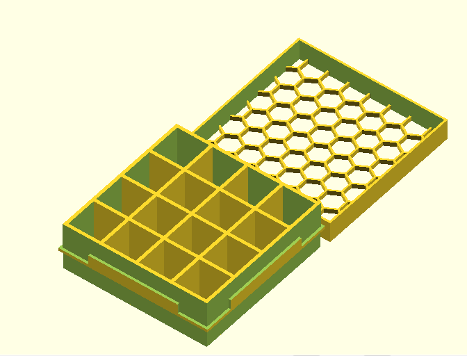

### Some Explanation
The first key-value pair is [ "example 0: minimal", _one_big_array_of_keyvalues_ ], and its value is an array of all of the details of the box. One of those key-pairs is `BOX_COMPONENT` which defines the one type of compartment we want. It's key-values all the way down. See https://www.thingiverse.com/thing:3435429 for an example of lots of compartments of lots of components in lots of boxes.


Here is an example of some compartments designed to hold cards, with holes to get our fingers in on the side. Many of these parameters are just the default values and are not necessary, but are included for easy modification:

    [   "example 2",
        [
            [ BOX_SIZE_XYZ,             [110.0, 180.0, 22.0] ],
            [ ENABLED_B,                t],

             [ BOX_LID,
                [
                    [ LID_SOLID_B,         f],
                    [ LID_FIT_UNDER_B,     f],
                    [ LID_PATTERN_RADIUS,  8],
                    [ LID_HEIGHT,          10 ],

                    [ LABEL,
                        [
                            [ LBL_TEXT,     "Skull     and"],
                            [ LBL_SIZE,     AUTO ],
                            [ ROTATION,     45 ],
                            [ POSITION_XY, [ 2,-2]],
                        ]
                    ],

                    [ LABEL,
                        [
                            [ LBL_TEXT,     "Crossbones"],
                            [ LBL_SIZE,     AUTO ],
                            [ ROTATION,     315 ],
                            [ POSITION_XY, [ -4,-0]],
                        ]
                    ],

                ],        
            ],

            [   BOX_COMPONENT,
                [
                    [CMP_COMPARTMENT_SIZE_XYZ,              [ 22, 60.0, 20.0] ],
                    [CMP_NUM_COMPARTMENTS_XY,               [2,2] ],
                    [CMP_SHAPE,                             SQUARE],
                    [CMP_SHAPE_ROTATED_B,                   f],
                    [CMP_SHAPE_VERTICAL_B,                  f],
                    [CMP_PADDING_XY,                        [10,12]],
                    [CMP_PADDING_HEIGHT_ADJUST_XY,          [-5, 0] ],
                    [CMP_MARGIN_FBLR,                       [0,0,0,0]],
                    [CMP_CUTOUT_SIDES_4B,                   [f,f,f,t]],
                    [ROTATION,                              5 ],
                    [POSITION_XY,                           [CENTER,CENTER]],
                    [LABEL,               
                        [
                            [LBL_TEXT,        [   
                                                ["backleft", "backright"],
                                                ["frontleft", "frontright"],
                                            ]
                            ],
                            [LBL_PLACEMENT,     FRONT],
                            [ ROTATION,         5],
                            [ LBL_SIZE,         AUTO],
                            [ POSITION_XY,      [ -4,-2]],
                            [ LBL_FONT,         "Times New Roman:style=bold italic"],

                        ]
                    ],  
                ]
            ],

           [ BOX_COMPONENT,
                [
                    [CMP_NUM_COMPARTMENTS_XY,       [1,1]],
                    [CMP_COMPARTMENT_SIZE_XYZ,      [ 60.0, 10.0, 5.0] ],
                    [POSITION_XY,                   [CENTER,165]],
                ]
            ],                              

        ]
    ],


And this is the result:

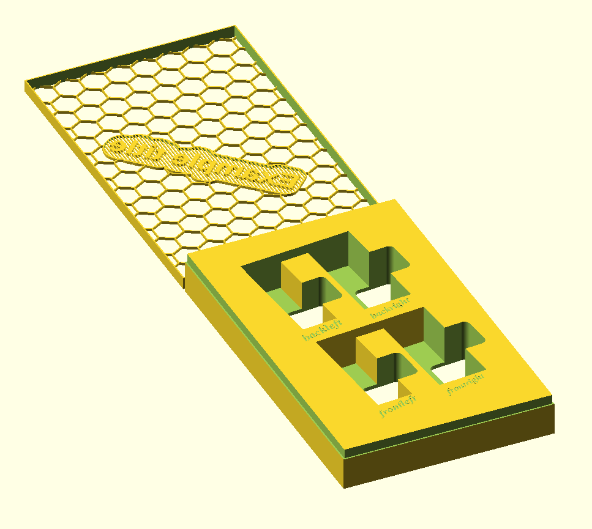

### Hexagonal Boxes
As of v3.00, there is now the ability to create hexagonal boxes as an efficient way to store hexagonal tiles (like those in Catan). Here is the code to produce a box to hold hexagonal tiles:

    include <bit_functions_lib.scad>;
    
    [   "hexbox example 1",
    [    
        [ TYPE, HEXBOX ],
        [ HEXBOX_SIZE_DZ,    [ 100, 40 ] ], 
        [ BOX_STACKABLE_B, t],
        [ BOX_COMPONENT, cmp_parms_hex_tile( dx=100, dz=38, lbl="CATAN LAND", font="Venturis ADF Cd:style=Bold" ) ], 
 
        [ BOX_LID, lid_parms( radius=12, lbl="CATAN", font="Venturis ADF Cd:style=Bold", size=22 ) ], 
    ]    
    ],

And the result:

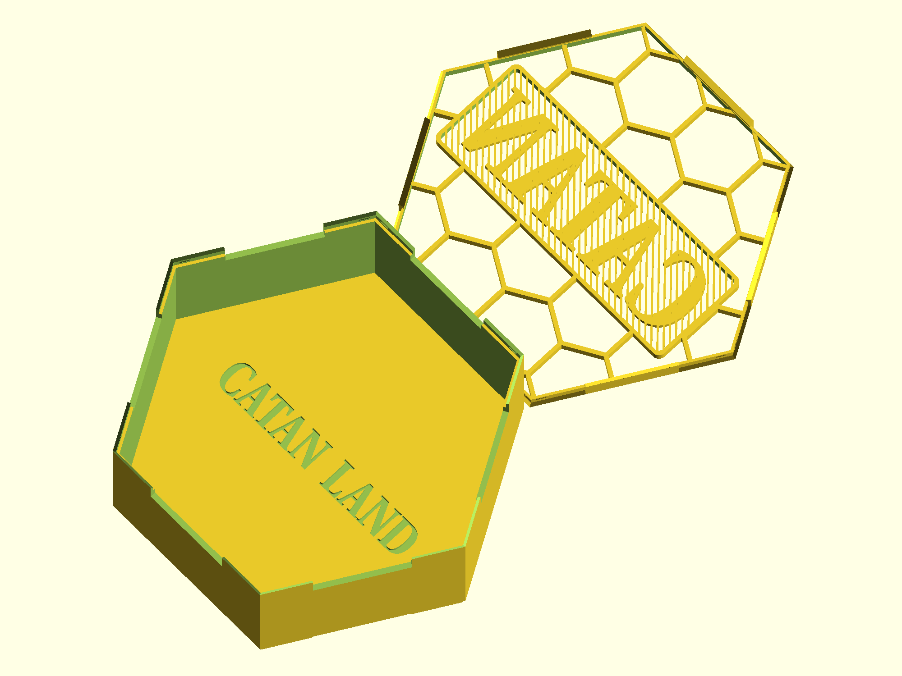

This also introduces __bit_functions_lib.scad__, which is intended to simplify the creation of components. By including it, you are able to create many parts with a single line. Here is the definition of _cmp_parms_hex_tile_:

```
// This function simplifies creating a hexagonal component
// Inputs:
// (dx, dz):     Size of the component - dx is the "diameter" of the tile, and dz is the depth of the stack
// (llx, lly):   Optional parameter - Location of lower left corner - defaults to (0, 0)
// lbl:          Optional parameter - Text to include on the bottom - defaults to blank
// font:         Optional parameter - OpensSCAD font specifier - defaults to g_default_font
// size:         Optional parameter - Size of label - defaults to AuTO
function cmp_parms_hex_tile( llx=0, lly=0, dx, dz, lbl="", font=g_default_font, size="AUTO" ) = 
[
    [CMP_COMPARTMENT_SIZE_XYZ,  [ dx, dx * sin(60), dz ] ],
    [POSITION_XY,  [ llx, lly ] ],
    [CMP_SHAPE, HEX2],
    [CMP_SHAPE_VERTICAL_B, t],
    [LABEL, 
    [ 
        [LBL_TEXT, lbl],
        [LBL_FONT, font ],
        [LBL_SIZE, size],
        [LBL_PLACEMENT, CENTER],
        [LBL_DEPTH, 1],
    ],
    ],
];
```
You can see that the optional parameters llx, lly, and size, are not specified in the creation of the box above. Each function provided in __bit_functions_lib.scad__ is similarly documented.

### Dividers
As of v2.04, there is also the ability to create card dividers in addition to boxes. A dividers definition looks like this:

    [ "divider example 1",
        [
            [ TYPE,                     DIVIDERS ],
            [ DIV_TAB_TEXT,             ["001","002","003"]],
            [ DIV_FRAME_NUM_COLUMNS,    2 ]
        ]
    ]

And produces something like this:

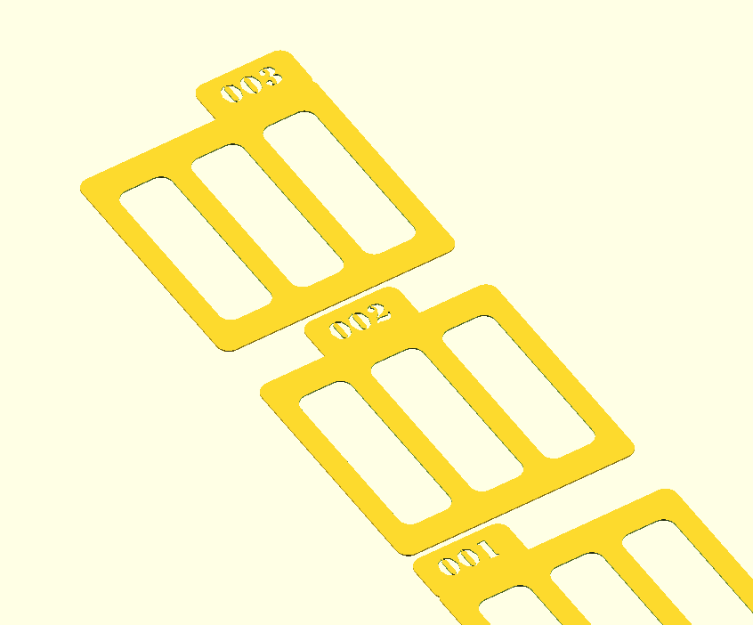

### Customizable Lid Patterns
As of v2.10, one can now tweak the lid pattern parameters. The default is still a honeycomb, but here are some alternatives:


    [   "lid pattern 1",
        [
            [ BOX_SIZE_XYZ,             [50.0, 50.0, 20.0] ],
            [ BOX_COMPONENT,
                [
                    [CMP_COMPARTMENT_SIZE_XYZ,  [ 47, 47, 18.0] ],
                ]
            ],  

             [ BOX_LID,
                [
                    [ LID_PATTERN_RADIUS,         10],        

                    [ LID_PATTERN_N1,               3 ],
                    [ LID_PATTERN_N2,               3 ],
                    [ LID_PATTERN_ANGLE,            0 ],
                    [ LID_PATTERN_ROW_OFFSET,       10 ],
                    [ LID_PATTERN_COL_OFFSET,       140 ],
                    [ LID_PATTERN_THICKNESS,        1 ]
                ]
            ]
        ]
    ],   

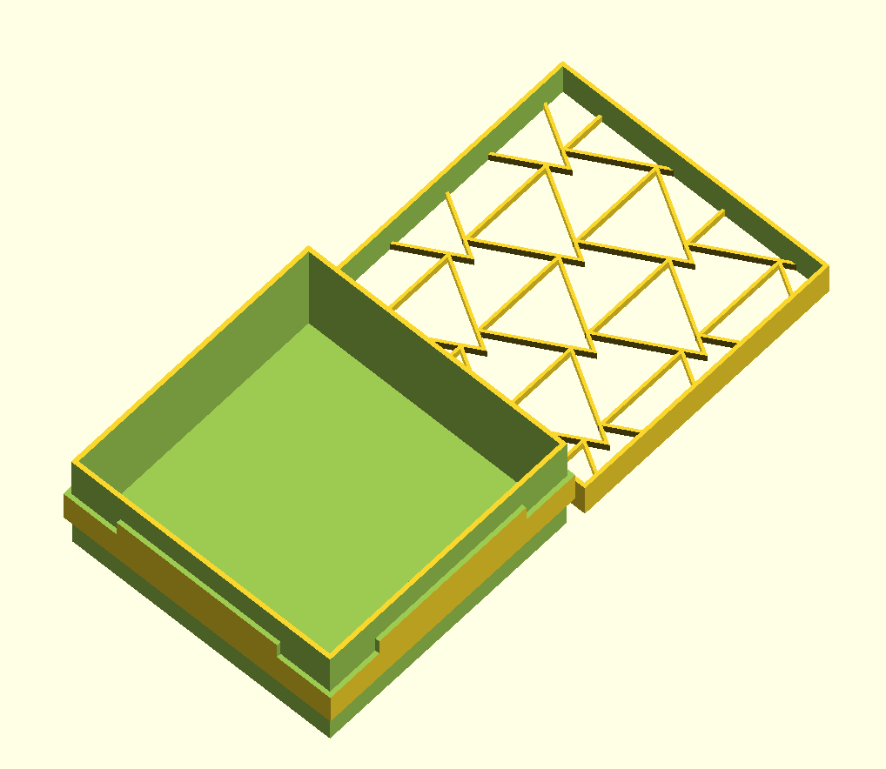

    [   "lid pattern 2",
        [
            [ BOX_SIZE_XYZ,             [50.0, 50.0, 20.0] ],
            [ BOX_COMPONENT,
                [
                    [CMP_COMPARTMENT_SIZE_XYZ,  [ 47, 47, 18.0] ],
                ]
            ],  

             [ BOX_LID,
                [
                    [ LID_PATTERN_RADIUS,         10],        
                    [ LID_PATTERN_N1,               8 ],
                    [ LID_PATTERN_N2,               8 ],
                    [ LID_PATTERN_ANGLE,            22.5 ],
                    [ LID_PATTERN_ROW_OFFSET,       10 ],
                    [ LID_PATTERN_COL_OFFSET,       130 ],
                    [ LID_PATTERN_THICKNESS,        0.6 ]
                ]
            ]
        ]
    ],

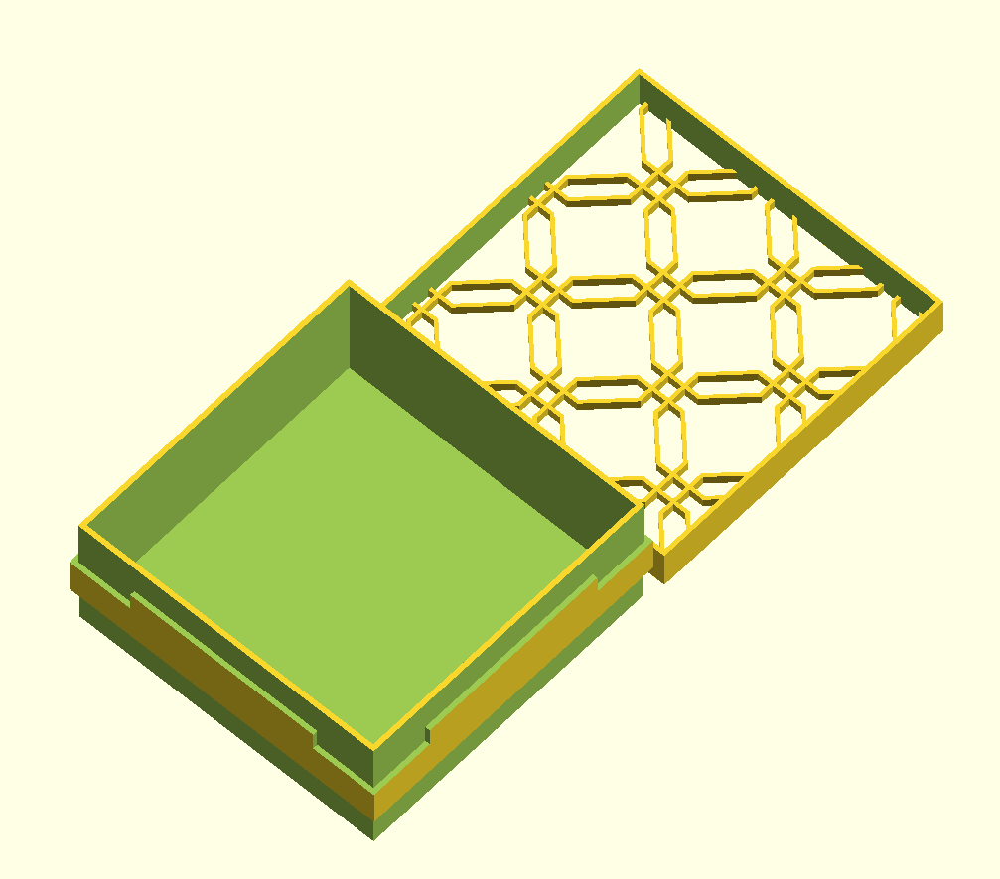

    [   "lid pattern 3",
        [
            [ BOX_SIZE_XYZ,             [50.0, 50.0, 20.0] ],
            [ BOX_COMPONENT,
                [
                    [CMP_COMPARTMENT_SIZE_XYZ,  [ 47, 47, 18.0] ],
                ]
            ],  

             [ BOX_LID,
                [
                    [ LID_PATTERN_RADIUS,         10],        

                    [ LID_PATTERN_N1,               6 ],
                    [ LID_PATTERN_N2,               3 ],
                    [ LID_PATTERN_ANGLE,            60 ],
                    [ LID_PATTERN_ROW_OFFSET,       10 ],
                    [ LID_PATTERN_COL_OFFSET,       140 ],
                    [ LID_PATTERN_THICKNESS,        0.6 ]
                ]
            ]
        ]
    ],    

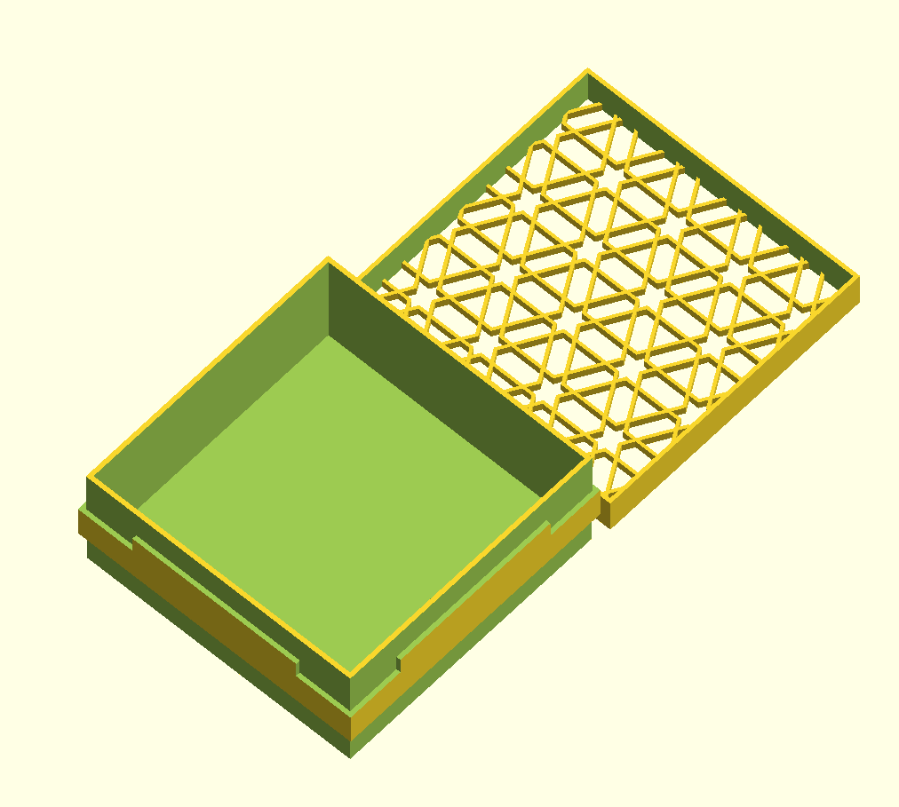


# Keys

#### `TYPE`
Value is expected to be one of the following:
- `BOX` (default) a box.
- `HEXBOX` a hexagonal box.
- `DIVIDERS` a set of dividers.

## Box keys

#### `BOX_SIZE_XYZ`
Value is expected to be an array of 3 numbers, and determines the exterior dimensions of the box as width, depth, height.  
e.g. `[ BOX_SIZE_XYZ, [ 140, 250, 80 ] ]`

#### `HEXBOX_SIZE_DZ`
Value is expected to be an array of 2 numbers, and determines the __interior__ dimension of the box as diameter, and the __exterior__ dimension as height.  
e.g., `[ HEXBOX_SIZE_DZ,    [ 100, 40 ] ],`

#### `BOX_COMPONENT`
Value is expected to be an array of components key-value pairs. Box can have as many of these as desired.

#### `BOX_LID`
Value is expected to be an array of lid key-value pairs.

#### `BOX_NO_LID_B`
Value is expected to be a bool, and determines whether a lid is ommitted. If ommitted, the box will not form an inset lip to support a lid.

#### `BOX_STACKABLE_B`
Value is expected to be a bool and determines whether the base of the box is cut to fit on top of an identically sized box. Note that this requires a printer that can print a 45 degree overhang without supports.

#### `BOX_VISUALIZATION`
To be documented later

## Lid keys
As of v2.09, all lid parameters are specified in a BOX_LID container. This makes it easy to reuse box lid parameters across multiple boxes.

#### `LID_INSET_B`
Value is expected to be a bool and determines whether the box will have an inset lid or a cap lid.
Considerations:
- Inset lids are required if the boxes are intended to snap fit as a stack ( BOX_STACKABLE_B true ).
- Cap lid is preferred for printers that are sloppier, since the cap lid is more forgiving.
- Cap lid is preferred if the cap will be used to hold pieces during play, since the inset lid does not have walls.

#### `LID_NOTCHES_B`
Value is expected to be a bool, "true", "false", "t", or "f", and determines whether the box will have notches that make pulling the lid off easier.  Only applies to cap lids ( LID_INSET_B false )
e.g. `[ LID_NOTCHES_B, f ]`

#### `LID_TABS_4B`
Value is expected to be an array of 4 bools, and determines on what sides the lid will have tabs when the lid is inset. The default is [ t,t,t,t ].

#### `LID_PATTERN_RADIUS`
Value is expected to be a number, and determines the radius of the hexes in the lid.  
e.g. `[ LID_PATTERN_RADIUS, 5 ]`

#### `LID_PATTERN_N1`
Value is expected to be a number, and determines the number of sides that the pattern outer shape has.  

#### `LID_PATTERN_N2`
Value is expected to be a number, and determines the number of sides that the pattern inner shape has. 

#### `LID_PATTERN_ANGLE`
Value is expected to be a number, and determines the angle of the pattern shape. 

#### `LID_PATTERN_ROW_OFFSET`
Value is expected to be a number, and determines the percent of height that each row will offset from each other. 

#### `LID_PATTERN_COL_OFFSET`
Value is expected to be a number, and determines the percent of width that each column will offset from each other. 

#### `LID_PATTERN_THICKNESS`
Value is expected to be a number, and determines the thickness of the shape, i.e. the difference between the inner and outer shapes` radius. 

#### `LID_FIT_UNDER_B`
Value is expected to be a bool, and determines whether the box bottom is formed to allow the box to sit in the lid when open. Note that this requires a printer that can print a 45 degree overhang without supports.

#### `LID_SOLID_B`
Value is expected to be a bool, and determines whether the lid is a hex mesh or solid.

#### `LID_SOLID_LABELS_DEPTH`
Value is expected to be a number, and if the lid is solid, determines how deep the label cut is.

#### `LID_LABELS_INVERT_B`
Value is expected to be a bool, and determines whether the lid label is a positive or negative shape.

#### `LID_LABELS_BG_THICKNESS`
Value is expected to be a number, and determines the thickness of the lid label background.

#### `LID_LABELS_BORDER_THICKNESS`
Value is expected to be a number, and determines the thickness of the lid label border.  Default is 0.3 mm

#### `LID_STRIPE_WIDTH`
Value is expected to be a number, and determines the thickness of the lines in the striped grid behind the label.  Default is 0.5 mm

#### `LID_STRIPE_SPACE`
Value is expected to be a number, and determines the spacing of the lines in the striped grid behind the label.  Default is 1.0 mm

#### `LID_HEIGHT`
Value is expected to be a number, and determines whether how deep the lid is. Default is 1mm for inset lids, and 2mm for cap lids.

#### `LID_CUTOUT_SIDES_4B`
Value is expected to be an array of 4 bools, and determines whether finger cutouts are to be added to the lid. This allows the lid to be used as a card tray during play. The values represent [front, back, left, right ].  
e.g. `[ LID_CUTOUT_SIDES_4B, [ t, t, f, f ] ]`

## Compartment keys

#### `CMP_NUM_COMPARTMENTS_XY`
Value is expected to be an array of 2 numbers, and determines how many compartments this component will have in the width and depth direction.  
e.g. `[ CMP_NUM_COMPARTMENTS_XY, [ 4, 6 ] ]`

#### `CMP_COMPARTMENT_SIZE_XYZ`
Value is expected to be an array of 3 numbers, and determines the interior dimensions of each compartment within the component.  
e.g. `[ CMP_COMPARTMENT_SIZE_XYZ, [ 10, 20, 5 ] ]`

#### `CMP_SHAPE`
Value is expected to be one of the following:
- `SQUARE`   default right angled compartment
- `FILLET`   a square compartment with rounded bottom corners on opposite edges
- `ROUND`    a round compartment
- `HEX`      a 6-sided compartment (flat side down)
- `HEX2`     a 6-sided compartment that is rotated 30 degrees (corner down)
- `OCT`      an 8-sided compartment (flat side down)
- `OCT2`     an 8-sided compartment that is rotated 22.5 degrees (corner down)

e.g. `[ CMP_SHAPE, HEX2 ]`. The following box shows all the different components. The front row has the components in the order listed above. The second row shows the same, but rotated (`[CMP_SHAPE_ROTATED_B]` below). The third row has the same order for vertical stacks of pieces (`[CMP_SHAPE_VERTICAL_B]` below).

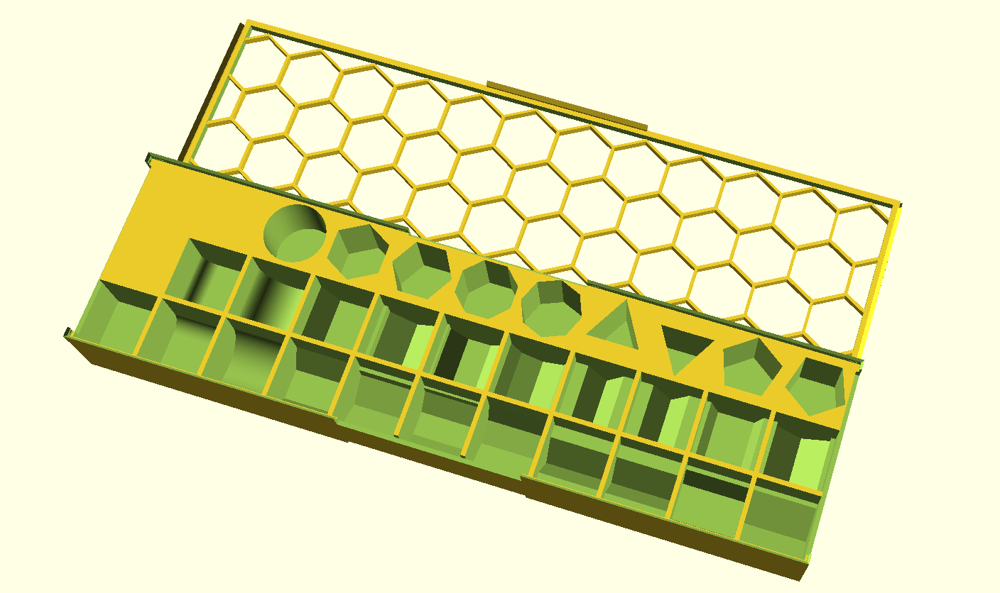

#### `CMP_SHAPE_ROTATED_B`
Value is expected to be a bool, and determines whether the shape is rotated along the Z axis. That is, whether it goes back and forth or side to side.

#### `CMP_SHAPE_VERTICAL_B`
Value is expected to be a bool, and determines whether the shape is rotated for vertical stacks of pieces.

#### `CMP_FILLET_RADIUS`
Value is expected to be a number, and determines the radius of the fillet, if shape is fillet.

#### `CMP_PEDESTAL_BASE_B`
Value is expected to be a bool, and determines whether the base of the compartment is a pedestal. This allows for cards or tiles to be extracted by pushing down on one of the sides. Ideal for short stacks and for compartments that are interior and where finger cutouts aren't possible or ideal. 

#### `CMP_PADDING_XY`
Value is expected to be an array of 2 numbers, and determines how far apart the compartments in a component array are, in the width and depth direction.  
e.g. `[ CMP_PADDING_XY, [ 2.5, 1.3 ] ]`

#### `CMP_PADDING_HEIGHT_ADJUST_XY`
Value is expected to be an array of 2 numbers, and determines how much to modify the height of the x and y padding between compartments. These should typically be negative values.  
e.g. `[ CMP_PADDING_HEIGHT_ADJUST_XY, [ -3, 0 ] ]`

#### `CMP_MARGIN_FBLR`
Value is expected to be an array of 4 floats, and determines the front, back, left, and right margins, respectively.  
e.g. `[ CMP_MARGIN_FBLR, [ 1, 10, 0, 20 ] ]`

#### `CMP_CUTOUT_SIDES_4B`
Value is expected to be an array of 4 bools, and determines whether finger cutouts are to be added to the compartments on the sides. The values represent [front, back, left, right ].  
e.g. `[ CMP_CUTOUT_SIDES_4B, [ t, t, f, f ] ]`

#### `CMP_CUTOUT_HEIGHT_PCT`
Value is expected to be an float between 0 and 100, and determines what percent of the box height is removed for finger cutouts, starting from the top.  The default is 100. 
e.g. `[ CMP_CUTOUT_HEIGHT_PCT, 100 ]`

#### `CMP_CUTOUT_DEPTH_PCT`
Value is expected to be an float between 0 and 100, and determines what percent of the box depth is removed for finger cutouts, when the cutout goes into the base of the box.  The default is 25. 
e.g. `[ CMP_CUTOUT_DEPTH_PCT, 25 ]`

#### `CMP_CUTOUT_WIDTH_PCT`
Value is expected to be an float between 0 and 100, and determines what percent of the box width is removed for finger cutouts.  The default is 50. 
e.g. `[ CMP_CUTOUT_WIDTH_PCT, 25 ]`

#### `CMP_CUTOUT_TYPE`
Value is expected to be one of the following keywords: BOTH, INTERIOR, or EXTERIOR, and determines whether where on the component the cutouts are applied.
e.g. `[ CMP_CUTOUT_TYPE, INTERIOR ]`

#### `CMP_CUTOUT_BOTTOM_B`
Value is expected to be a bool and determines whether the bottom of the compartment is cut out. Note that this is ignored if CMP_PEDESTAL_BASE_B is true or if CMP_SHAPE is set to FILLET.
e.g. `[ CMP_CUTOUT_BOTTOM, true ]`

#### `CMP_CUTOUT_BOTTOM_PCT` 
Value is expected to be an float between 0 and 100, and determines what percent of the box bottom is removed for bottom cutouts.  The default is 80. 
e.g. `[ CMP_CUTOUT_BOTTOM_PCT, 90 ]`

#### `CMP_CUTOUT_CORNERS_4B`
Value is expected to be an array of 4 bools, and determines whether finger cutouts are to be added to the compartments on the corners. The values represent [front-left, back-right, back-left, front-right ].  
e.g. `[ CMP_CUTOUT_CORNERS_4B, [ t, t, f, f ] ]`

#### `CMP_SHEAR`
Value is expected to be an array of 2 numbers, and determines the degrees to which the component should be sheared in the direction of width and depth. The shearing pivots around the center of the component. 
e.g. `[ CMP_SHEAR, [ 45, 0 ] ]`

## Label keys
Key-pairs that are expected in a LABEL container.

#### `LABEL`
Value is expected to be an array of key-values that define a label. Labels can be defined at the box level for box labels, inside BOX_LID arrays for labels that will appear on the lid, and inside BOX_COMPONENT arrays for labels that will appear on the compartments. Each supports as many labels as desired.

#### `LBL_TEXT`
Value is expected to either be a string, or an array of strings matching the structure of the compartments. A single string will label every compartment with that string while an array will label each compartment with its respective string.  
e.g. `[ LBL_TEXT, "tokens" ]`  
or

    [ LBL_TEXT,        
        [   
            ["back left", "back right"],        
            ["front left", "front right"],
        ]
    ]

#### `LBL_IMAGE`
Value is expected to be a string specifying an SVG filename. `LBL_TEXT` takes priority over `LBL_IMAGE`, so if both are provided, only the string will be used. **Warning:** this option will slow things down considerably.
e.g. `[ LBL_IMAGE, "image.svg" ]`

#### `LBL_SIZE`
Value is expected to either be `AUTO` or a number. `AUTO` will attempt to scale the label to fit in the space according to _width_. This does not work will with very short words. A number will specify the font size (if `LBL_TEXT`) or the image width (if `LBL_IMAGE`).
e.g. `[ LBL_SIZE, 12 ]`

#### `LBL_SPACING`
Value is expected to be a number, and determines the letter spacing. 
e.g. `[ LBL_SPACING, 1.1 ]`


#### `LBL_PLACEMENT`
Value is expected to be one of the following:  
- `FRONT`
- `BACK`
- `LEFT`
- `RIGHT`
- `FRONT_WALL`
- `BACK_WALL`
- `LEFT_WALL`
- `RIGHT_WALL`
- `CENTER`
- `BOTTOM`  

Front, back, left, and right, will place the label on the top surface, while the _wall values will place the label inside, on the compartment wall. Center will place the label on the compartment floor. Bottom is for labeling the bottom of the box.

#### `LBL_FONT`
Value is expected to be a string that determines what font to use for the label. More [here](https://en.wikibooks.org/wiki/OpenSCAD_User_Manual/Text#Using_Fonts_&_Styles).  
e.g. `[ LBL_FONT, "Times New Roman:style=bold italic" ]`

#### `LBL_DEPTH`
Value is expected to be a number, and determines how deep the label should cut.  
e.g. `[ LBL_DEPTH, 0.5 ]`

#### `ROTATION`
Value is expected to be a number, and determines the degree to which the component or label is to be rotated.  
e.g. `[ ROTATION, 45 ]`

#### `POSITION_XY`
Value is expected to be an array of 2 numbers, although `MAX` is also valid, and determines the position of the label or component. 
- When used on a label, the values are relative to reasonable centers and can be used to adjust the positioning of the text.
- When used on a component, it is always relative to the origin of the box, and almost always needs to be present.
- When used on a component, the value `MAX` essentially aligns that value to opposite end, so 'right' when placed in the x position, and 'back' when placed in the y position.  
e.g. `[ POSITION_XY, [ 20, MAX ] ]`

#### `ENABLED_B`
Value is expected to be a bool, and determines whether the box, component, or label, is used. This allows for easily turning features off temporarily or permanently without needing to delete lots of content.  
e.g. `[ ENABLED_B, f ]`

## Dividers keys
As of v2.04, in addition to boxes, one can also create card dividers.

#### `DIV_THICKNESS`
Value is expected to be a number, and determines the thickness of each divider.

#### `DIV_FRAME_SIZE_XY`
Value is expected to be an array of 2 numbers, and determines the width and height of each divider (without the tab).

#### `DIV_FRAME_TOP`
Value is expected to be a number, and determines the height of the top bar of the divider.

#### `DIV_FRAME_BOTTOM`
Value is expected to be a number, and determines the height of the bottom bar of the divider.

#### `DIV_FRAME_COLUMN`
Value is expected to be a number, and determines the width of the vertical bars of the divider.

#### `DIV_FRAME_RADIUS`
Value is expected to be a number, and determines the radius of the frame corners of the divider.

#### `DIV_FRAME_NUM_COLUMNS`
Value is expected to be a number, and determines the number of columns in the middle of the frame of the divider. 0 makes for a frame that has no middle columns. -1 makes for a solid divider with no holes.

#### `DIV_TAB_SIZE_XY`
Value is expected to be an array of 2 numbers, and determines the width and height of each divider's tab.

#### `DIV_TAB_RADIUS`
Value is expected to be a number, and determines the radius of the corner of the tab on the divider.

#### `DIV_TAB_CYCLE`
Value is expected to be a number, and determines over how many dividers should the tab drift from left to right.

#### `DIV_TAB_CYCLE_START`
Value is expected to be a number, and determines the starting position of the first divider.  Default is 1.

#### `DIV_TAB_TEXT`
Value is expected to be an array of strings, and determines what dividers get created.
e.g. `[ DIV_TAB_TEXT, [ "Tab-1", "Tab-2", "Tab-3", "Tab-4" ] ]`

#### `DIV_TAB_TEXT_SIZE`
Value is expected to be a number, and determines the font size of the tab text.

#### `DIV_TAB_TEXT_FONT`
Value is expected to be a string, and determines the font of the tab text. More [here](https://en.wikibooks.org/wiki/OpenSCAD_User_Manual/Text#Using_Fonts_&_Styles).  
e.g. `[ LBL_FONT, "Times New Roman:style=bold italic" ]`

#### `DIV_TAB_TEXT_SPACING`
Value is expected to be a number, and determines the letter spacing of the tab text.

#### `DIV_TAB_TEXT_CHAR_THRESHOLD`
Value is expected to be a number, and determines the number of characters above which the size of the font should be determined automatically.

# Published inserts:


- [1830]( https://www.thingiverse.com/thing:3499314)
- [18 India](https://www.thingiverse.com/thing:6732380)
- [7th Continent dividers]( https://www.thingiverse.com/thing:4223923)
- [Architects of the West Kingdom](https://www.thingiverse.com/thing:3937497)
- [Argent Consortium](https://www.thingiverse.com/thing:4549937)
- [BattleLore Second Edition](https://www.printables.com/model/60472-battlelore-second-edition-insert)
- [Bios: Megafauna](https://www.thingiverse.com/thing:3493660)
- [Bios:Genesis](https://www.thingiverse.com/thing:3452368)
- [Castle von Loghan](https://www.printables.com/model/233659-insert-for-castle-von-loghan)
- [Comanchería]( https://www.thingiverse.com/thing:4187266)
- [DiceWar Light of Dragons](https://www.thingiverse.com/thing:6527847)
- [Dinosaur Island Deluxe Edition](https://www.thingiverse.com/thing:4015696)
- [Dune]( https://www.thingiverse.com/thing:4403586 )
- [Dune: Imperium ultimate organizer](https://www.thingiverse.com/thing:6918725)
- [Empyreal Spells & Steam]( https://www.thingiverse.com/thing:4554217 )
- [Empyreal Spells % Steam](https://www.thingiverse.com/thing:4554217)
- [Greenland/Neanderthal]( https://www.thingiverse.com/thing:3469793)
- [Hadrian's Wall](https://www.printables.com/model/90472-insert-for-hadrians-wall-board-game)
- [Happy Pigs](https://www.thingiverse.com/thing:4031037)
- [High Frontier (3rd)]( https://www.thingiverse.com/thing:3482341)
- [Indonesia (upgraded goods and ships )]( https://www.thingiverse.com/thing:3454636)
- [Indonesia (upgraded goods)]( https://www.thingiverse.com/thing:3446879)
- [Nemesis Lockdown](https://makerworld.com/de/models/1121255#profileId-1119721)
- [Journeys in Middle-Earth Battle-Map Terrain box](https://www.printables.com/model/60425-journeys-in-middle-earth-battle-map-terrain-stuff)
- [Maqui 2nd edition](https://www.printables.com/model/90469-insert-for-maqui-board-game-2nd-printing)
- [Mansions of Madness 2nd edition persons container](https://www.printables.com/model/60421-mansions-of-madness-2nd-edition-persons-container)
- [Mezo](https://makerworld.com/de/models/1067723)
- [Mice and Mystics]( https://www.thingiverse.com/thing:3435429)
- [Noria](https://www.thingiverse.com/thing:6162186)
- [Orleans]( https://www.thingiverse.com/thing:4493482 )
- [Pandemic]( https://www.thingiverse.com/thing:3412724)
- [Pagan Fate of Roanoke](https://makerworld.com/de/models/1079030)
- [Pax Emancipation]( https://www.thingiverse.com/thing:3450282)
- [Pax Porfiriana (Collector's Edition)]( https://www.thingiverse.com/thing:3478944)
- [Pax Renaissance]( https://www.thingiverse.com/thing:3479114)
- [Puerto Rico](https://makerworld.com/de/models/1069603)
- [Root](https://www.printables.com/model/60470-root-insert-for-custom-miniatures)
- [Space Hulk Death Angel](https://www.thingiverse.com/thing:4592270)
- [Spyrium](https://www.thingiverse.com/thing:4010875)
- [Star Trek: Frontiers](https://www.printables.com/model/60422-star-trek-frontiers)
- [Stuffed Fables]( https://www.thingiverse.com/thing:3535505)
- [Sword & Sorcery plus Expansions](https://www.thingiverse.com/thing:3699454)
- [Sword & Sorcery]( https://www.thingiverse.com/thing:3515523)
- [Sword & Sorcey Cards box and Chit box](https://www.thingiverse.com/thing:3637030)
- [Tainted Grail: Fall of Avalon](https://www.thingiverse.com/thing:4812198) & [Tainted Grail Expansions](https://www.thingiverse.com/thing:4812222)
- [Tapestry](https://www.thingiverse.com/thing:4579132)
- [Tyrants of the Underdark]( https://www.thingiverse.com/thing:4570276 )
- [V Commandos]( https://www.thingiverse.com/thing:4319308 )
